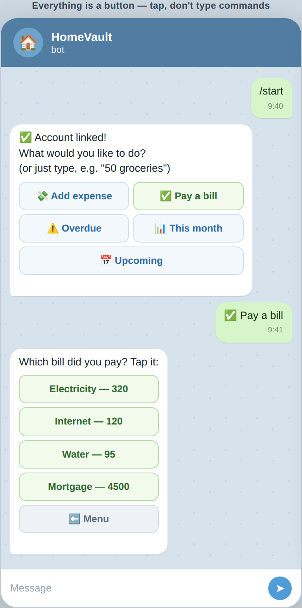
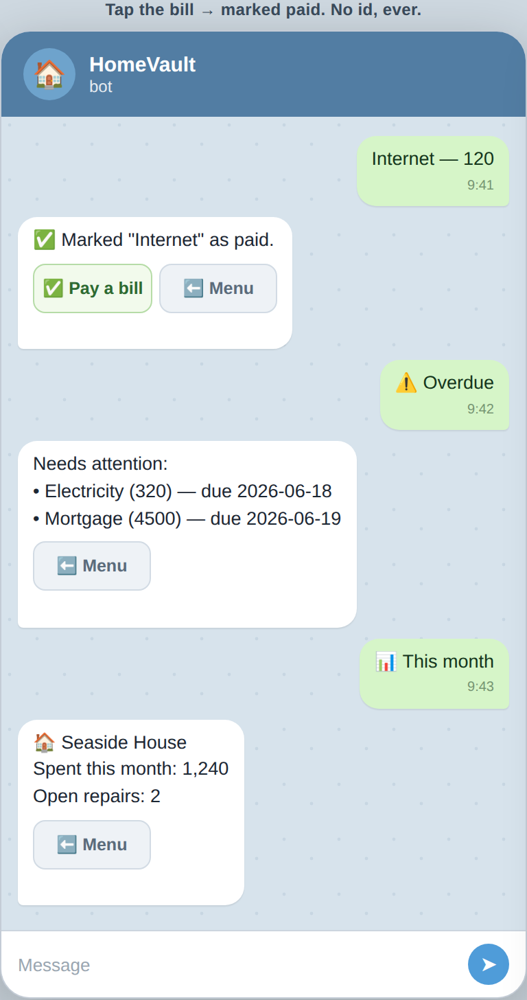
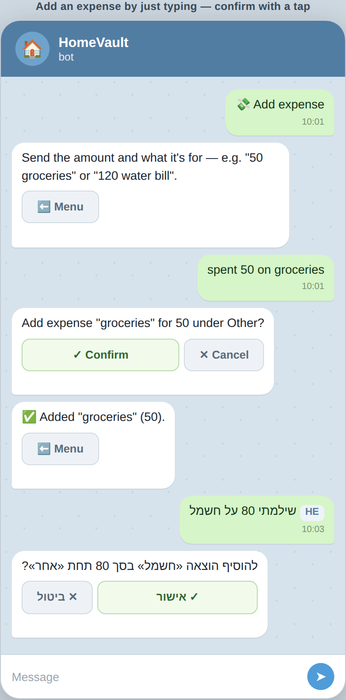

# Telegram bot — interactive, button-driven

The bot is now **button-first**. After linking, it shows a menu and you tap your
way through everything — you never need to type a slash command or know an
internal id. Free-text typing still works as a shortcut, and the classic slash
commands remain for power users.


## The menu

Every action is one tap away:

| Button | What it does |
| --- | --- |
| 💸 **Add expense** | Prompts you to type the amount + name (e.g. `50 groceries`), then a **Confirm** button |
| ✅ **Pay a bill** | Lists your **unpaid bills as buttons** — tap the one you paid; no id needed |
| ⚠️ **Overdue** | Items needing attention |
| 📊 **This month** | Dashboard at a glance |
| 📅 **Upcoming** | Events & due dates |
| ⬅️ **Menu** | Appears on every screen to go back |

## Paying a bill — the important part

Previously you had to know the expense's id (`/paid exp-7`). That made no sense —
you'd never know the id. Now:

1. Tap **✅ Pay a bill** (or just type "pay a bill").
2. The bot lists your unpaid bills as buttons: `Electricity — 320`, `Internet — 120`, …
3. **Tap the bill you paid** → it's marked paid instantly, and the bot offers to
   pay another or go back to the menu.

| Menu → pick a bill | Tap it → done + reads | Add expense by typing |
| --- | --- | --- |
|  |  |  |

## You can also just type (optional shortcut)

Buttons are the main path, but plain chat works too, in English, Russian and
Hebrew — handy if you already know what you want:

- `50 groceries`, `spent 50 on groceries`, `bought coffee $4.50` → log an expense
- `pay a bill`, `оплатить`, `לשלם` → opens the tap-to-pay list
- `what's overdue?`, `how's this month?`, `what's upcoming?` → reads
- `menu` → back to the menu

The bot always replies with the relevant buttons, so you can keep tapping from there.

## How it works

- **Buttons** carry a short `callback_data` string built/parsed by pure helpers
  in [`server/bot/commands.ts`](../../server/bot/commands.ts) (`menuCallback`,
  `payCallback`, `addExpenseCallback`, `parseCallback`) — unit-tested in
  `commands.test.ts`. The expense id rides inside the button's data, so it's
  never shown to or typed by the user.
- **Pay flow** lists `getExpenses(...)` filtered to unpaid (oldest/overdue first,
  capped at 10) as one button per bill.
- **Text** is parsed by the same pure layer (`parseCommand` /
  `parseNaturalLanguage`); writes (add expense) always confirm before committing.
- The Telegram "/" command menu is published via `setMyCommands` on connect.
- The whole interaction is **stateless** (everything needed is encoded in the
  callback data), so it works identically under webhook and long-polling.

## Regenerating the screenshots

```bash
node docs/telegram-bot/screenshot.mjs
```

Renders `mockup.html` with the container's Chromium. Static mockup — no app or
backend required.
