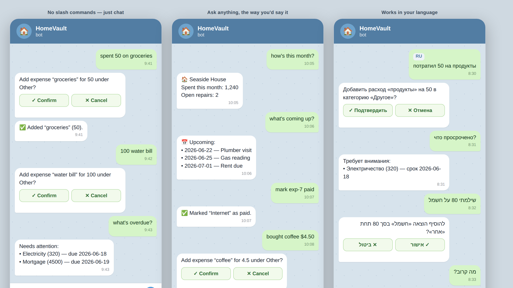
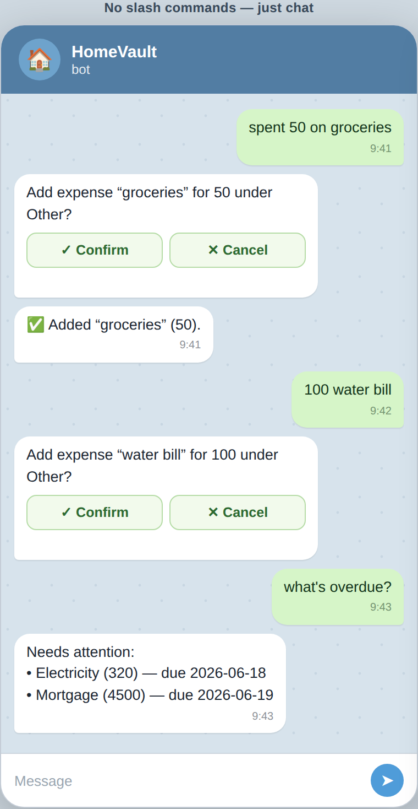
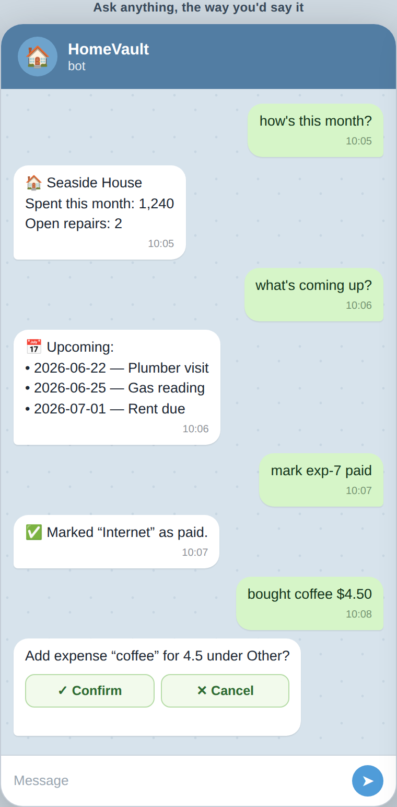
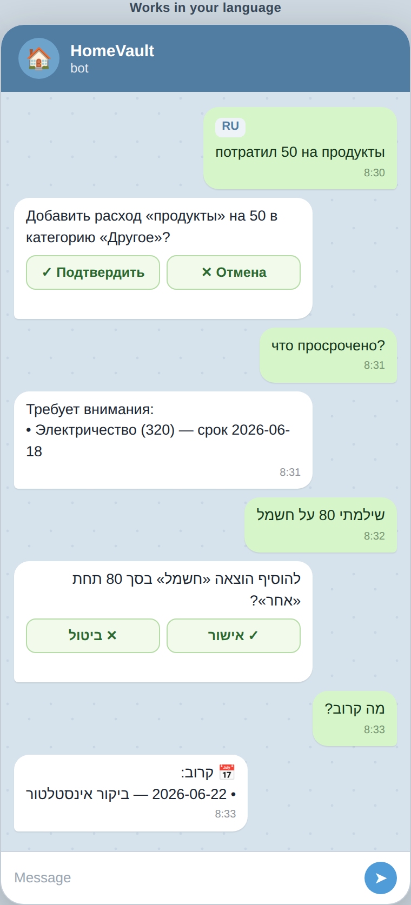

# Telegram bot — natural-language commands

The bot used to require a slash command for every action (`/addexpense 50 Water`,
`/overdue`, …). It now understands plain chat, so you can talk to it the way you'd
text a person — **no slash commands needed**. The classic slash commands still
work and are advertised in Telegram's "/" menu.



## What you can just type

| You say | The bot does |
| --- | --- |
| `spent 50 on groceries` | Logs a 50 expense named "groceries" (asks to confirm) |
| `100 water bill` | Logs a 100 expense named "water bill" |
| `bought coffee $4.50` | Handles currency symbols & decimals |
| `paid 30 for gas` | Treated as an expense (amount → log), not a payment |
| `what's overdue?` | Items needing attention |
| `how's this month?` | Dashboard at a glance |
| `what's coming up?` | Upcoming events & due dates |
| `mark exp-7 paid` | Marks expense `exp-7` paid (non-numeric id → payment) |
| `help` / `what can you do` | Shows the help card |

Write expenses still confirm before committing (Confirm / Cancel buttons).

## Multilingual

Natural language is recognized in the bot's three supported languages — English,
Russian and Hebrew — and replies in the user's chosen language:

- `потратил 50 на продукты`, `что просрочено?`, `сколько я потратил`
- `שילמתי 80 על חשמל`, `מה קרוב?`, `מה באיחור?`

| Expenses | Ask anything | Multilingual |
| --- | --- | --- |
|  |  |  |

## How it works

- Parsing is pure and unit-tested in [`server/bot/commands.ts`](../../server/bot/commands.ts)
  (see `commands.test.ts`). Slash commands are parsed first; free text falls
  through to `parseNaturalLanguage`.
- Resolution order avoids collisions: **mark-paid** (id-carrying phrasings) →
  **expense** (any money amount) → **read intent** keyword (overdue / dashboard /
  upcoming / help) → unknown (replies with a help hint).
- The Telegram "/" command menu is published via `setMyCommands` on connect.

## Regenerating the screenshots

```bash
node docs/telegram-bot/screenshot.mjs
```

Renders `mockup.html` with the container's Chromium. Static mockup — no app or
backend required.
