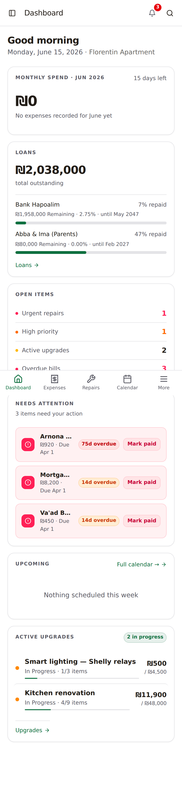
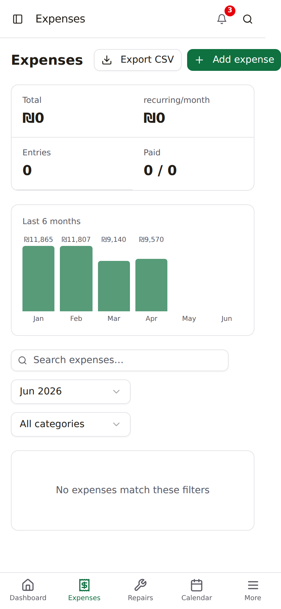
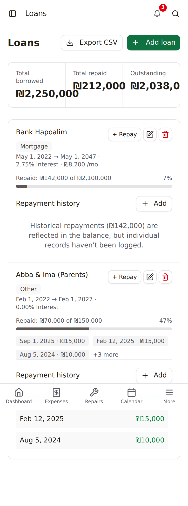
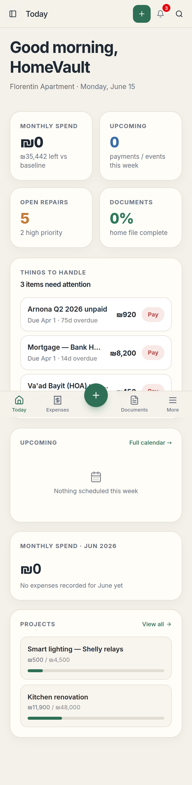
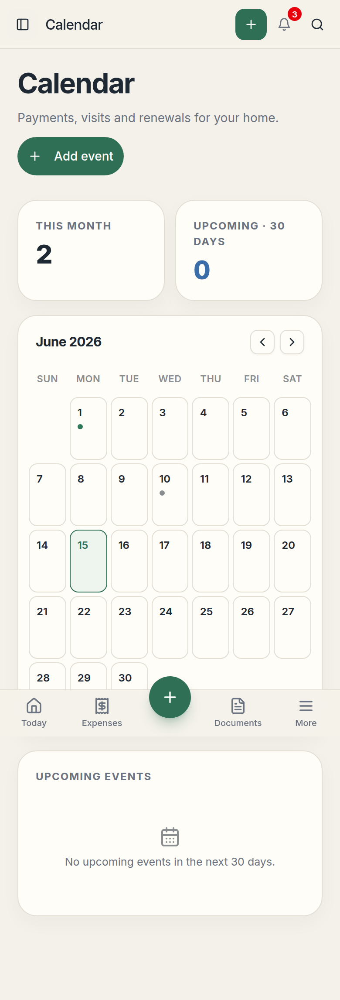
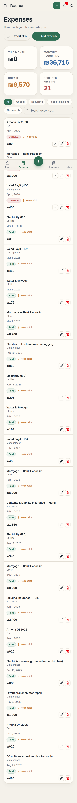

# UI Space-Efficiency Audit — HomeVault

**Date:** 2026-06-15 · **Branch:** `claude/ui-space-efficiency-audit-bsnhwv`
**Scope:** both UIs — the default `DashboardLayout` ("old UI") and the opt-in
HomeVault `hv-ui` ("new UI"). Focus is mobile (≤768px) but most items help desktop too.

## What this document is

A map of every place the UI spends a lot of pixels (mostly vertical space on
mobile) to show very little data, with a concrete, low-risk fix for each. **No
code has been changed.** Each finding is a checkbox — tick the ones you want and
I'll implement only those, then produce before/after screenshots per change.

### How to read a finding
Each item lists: **severity**, the **file:line**, the **current** Tailwind
classes, the **suggested** replacement, and the rough **mobile px saved**.

### Fix idiom (applies throughout)
Keep the existing Tailwind scale and shadcn primitives. Make spacing tighter on
mobile and restore the current value on desktop with a `md:` prefix, e.g.
`p-5` → `p-3.5 md:p-5`, `text-[32px]` → `text-2xl md:text-[32px]`. This means
**desktop is unchanged** unless a finding says "global". Touch targets stay ≥44px.

---

## ⭐ Recommended quick-win set
Highest return for least risk / smallest diff. If you only pick a few, pick these:

- **C1** — shrink new-UI page header (hits every new-UI page)
- **C2 / A6** — shrink KPI/metric cards (hits every KPI row, both UIs)
- **D2** — calendar day-cell height (biggest single mobile win)
- **A2** — empty states (appear on nearly every list page)
- **A1** — list-row padding (compounds across long lists)
- **B1 / C7** — layout content padding on mobile

---

## A. Cross-cutting patterns (affect many screens)

- [ ] **A1 — List-row vertical padding** · *High*
  Old-UI list rows use `px-4 py-3.5` (Expenses `Expenses.tsx:573`, Repairs,
  Upgrades `:187`, Loans). 28px of vertical padding per row before content.
  **Fix:** `py-2.5 md:py-3.5`, or adopt the existing compact `Item` `sm` variant
  (`client/src/components/ui/item.tsx`, `py-3 px-4`). **~10px × every row.**

- [ ] **A2 — Oversized empty states** · *High*
  `py-12` / `p-10` boxes, and the shared `ui/empty.tsx` uses `p-6 md:p-12`.
  Appears on every list page when filtered/empty (see Expenses & Calendar shots).
  **Fix:** `py-8` on mobile and a smaller icon. **~16–24px each, often more.**

- [ ] **A3 — Card padding** · *Med*
  `p-4`/`p-5` on cards across both UIs; compounds in grids of cards.
  **Fix:** `p-3.5 md:p-5` (new UI) / `p-3 md:p-4` (old UI).

- [ ] **A4 — Section gaps on stacked mobile layouts** · *Med*
  `space-y-3` / `gap-[18px]` / `mt-[18px]` between full-width stacked sections.
  **Fix:** `gap-2 md:gap-[18px]`, `mt-3 md:mt-[18px]`, etc.

- [ ] **A5 — Mobile bottom padding** · *Med*
  Both layouts reserve `pb-[calc(6rem + safe-area)]` for the bottom nav.
  Nav bar is ~54–60px; 6rem (96px) leaves a large dead gap under content.
  **Fix:** trim to `pb-[calc(4.5rem + safe-area)]` (verify FAB clearance in new UI).

- [ ] **A6 — KPI/stat cards: one number in a tall box** · *Med*
  Both UIs put a single value in a generously padded card with a big value font.
  Detailed under **C2** (new UI) and **B2/B3** (old UI). Most visible offender:
  the Calendar KPIs ("THIS MONTH 2", "UPCOMING·30 DAYS 0").

---

## B. Old UI — per screen

- [ ] **B1 — `DashboardLayout.tsx`** · *High*
  Main content `p-4 pb-[calc(6rem…)]` (`~:668`), mobile topbar `h-14` (`~:613`).
  **Fix:** keep `p-4` but trim bottom pad (A5); topbar is acceptable.

- [ ] **B2 — `pages/Dashboard.tsx`** · *High*
  Card `p-4` (`~:88`); KPI label `uppercase tracking-widest mb-3` (`~:111`) —
  the wide tracking + `mb-3` adds visual height above a tiny value; attention
  alert rows `px-3 py-2.5` (`~:432`); calendar empty `py-6` (`~:555`); open-items
  rows `py-2` + group `mb-3` (`~:165`).
  **Fix:** `p-3.5 md:p-4`, label `mb-1.5`, alert rows `py-2`, empty `py-4`.

- [ ] **B3 — `pages/Expenses.tsx`** · *High*
  Stat cells `px-4 py-3.5` (`:479`) in a 2×2 grid of single numbers; expense
  rows `flex … gap-4 px-4 py-3.5` (`:573`); two filter selects stacked
  full-width (see shot — lots of vertical space); empty `px-4 py-12` (`:544`);
  add-expense dialog `space-y-3 pt-1` (`~:311`).
  **Fix:** stat cells `px-3 py-2.5`, rows `py-2.5 md:py-3.5`, put the two filter
  selects on one row (`flex gap-2`), empty `py-8`, dialog `space-y-2.5`.

  

- [ ] **B4 — `pages/Repairs.tsx`** · *Med*
  Stat strip `px-4 py-3.5` (`~:471`); empty `p-10 space-y-4` (`~:425`);
  `RepairRow` gaps `gap-4` + `mt-1.5`/`mt-0.5` (`~:214`).
  **Fix:** stat `px-3 py-2.5`, empty `p-6 space-y-3`, row `gap-3`.

- [ ] **B5 — `pages/Upgrades.tsx`** · *Med*
  Same stat strip `px-4 py-3.5` (`~:433`); `UpgradeRow` `px-4 py-3.5` + nested
  `mt-2 space-y-1` budget block (`~:187`).
  **Fix:** mirror B4; row `py-2.5 md:py-3.5`.

- [ ] **B6 — `pages/Loans.tsx`** · *Med*
  Loan item `px-4 py-4` (`~:531`); **redundant double margin** `mt-auto pt-4
  border-t mt-4` (`~:610`) — the second `mt-4` is dead/duplicated; empty
  `px-4 py-12` (`~:508`).
  **Fix:** item `px-3.5 py-3`, remove the duplicate `mt-4`, empty `py-8`.

  

> Also captured for reference: `old-repairs.png`, `old-upgrades.png`,
> `old-calendar.png` in `ui-audit-screenshots/`.

---

## C. New UI (HomeVault) — shared components
These hit *every* new-UI page, so they're the highest-leverage fixes.

- [ ] **C1 — `components/homevault/HVChrome.tsx` (page header)** · *High*
  Title `text-[32px]` (`:151`) wraps to two lines on a phone (see "Good morning,
  HomeVault" / "Calendar" shots); wrapper `mb-7` (`:149`); subtitle `mt-2` (`:155`).
  **Fix:** `text-2xl md:text-[32px]`, `mb-5 md:mb-7`, `mt-1 md:mt-2`. **~40–60px.**

- [ ] **C2 — `components/homevault/MetricCard.tsx`** · *High*
  Card `p-5` (`:45`); value `text-[30px]` (`:54`); `mt-2` value + `mt-1.5`
  helper (`:54/:61`). A single KPI number sits in a tall, heavily-padded box.
  **Fix:** `p-3.5 md:p-5`, `text-2xl md:text-[30px]`, `mt-1 / mt-1`.

- [ ] **C3 — `components/homevault/HVCard.tsx`** · *Med*
  Default `p-5` (`:31`); flush header `px-5 pt-5` (`:39`); header→body `mb-4` (`:40`).
  **Fix:** `p-3.5 md:p-5`, `px-3.5 pt-3.5 md:px-5 md:pt-5`, `mb-3 md:mb-4`.

- [ ] **C4 — `components/homevault/ActionItem.tsx`** · *Med*
  `px-3.5 py-3` (`~:41`).
  **Fix:** `px-3 py-2.5 md:px-3.5 md:py-3`.

- [ ] **C5 — `components/homevault/UpcomingEventItem.tsx`** · *Low*
  Date tile `h-[50px] w-[50px]` (`~:34`) for a 2-digit day number.
  **Fix:** `h-11 w-11 md:h-[50px] md:w-[50px]`.

- [ ] **C6 — `components/homevault/RepairCard.tsx`** · *Med*
  `p-3.5 gap-2.5` (`~:47`); footer `border-t pt-2.5` (`~:70`).
  **Fix:** `p-2.5 md:p-3.5`, `gap-2 md:gap-2.5`, `pt-2 md:pt-2.5`.

- [ ] **C7 — `components/homevault/HomeVaultLayout.tsx`** · *Med*
  Main content `p-5 pb-[calc(6rem…)] md:px-9 md:pt-7 md:pb-9` (`~:652`).
  **Fix:** `p-4 md:p-5 md:px-9 …` and trim the 6rem bottom pad (see A5; keep FAB clearance).

---

## D. New UI (HomeVault) — per page

- [ ] **D1 — `pages/homevault/Today.tsx`** · *Med*
  Section gaps `gap-[18px]` (`:530`) / `mt-[18px]` (`:551`); KPI grid `gap-3.5`
  (`~:490`); empties `py-10` (`~:163`) and `py-8` (`~:214`); project tiles `p-3.5`
  (`~:360`).
  **Fix:** `gap-2 md:gap-[18px]`, `mt-3 md:mt-[18px]`, empties `py-6`/`py-5`,
  tiles `p-2.5 md:p-3.5`. (Plus C1/C2 above shrink the header + KPIs.)

- [ ] **D2 — `pages/homevault/Calendar.tsx`** · *High*
  Day cells `min-h-[72px] … p-2` (`:403`) — ~35 cells, mostly empty on a phone
  (see shot); month header `px-5 pt-4` (`:351`); grid container `p-3` (`:375`);
  KPI grid `gap-3` (`:338`); upcoming empty `py-8` (`:448`).
  **Fix:** `min-h-[60px] md:min-h-[72px]`, `p-1.5 md:p-2`, header `px-3 pt-3 md:px-5
  md:pt-4`, container `p-2 md:p-3`, empty `py-5 md:py-8`. **~12px × ~6 rows ≈ 70px+.**

  

- [ ] **D3 — `pages/homevault/Repairs.tsx`** · *Med*
  Empty `py-12` (`~:297`); board columns `gap-3.5` + column `p-3.5` (`~:314/:318`);
  items `space-y-3` (`~:328`).
  **Fix:** empty `py-8`, `gap-2.5 md:gap-3.5`, column `p-2.5 md:p-3.5`,
  `space-y-2 md:space-y-3`.

- [ ] **D4 — `pages/homevault/Projects.tsx`** · *Med*
  Empty `py-12` (`~:412`); KPI `gap-3` (`~:431`); section `mb-5` (`~:291`);
  grid `gap-3` (`~:300`); `ProjectCard` `p-4 gap-3` (`~:187`).
  **Fix:** empty `py-8`, `gap-2 md:gap-3`, `mb-3 md:mb-5`, card `p-3 md:p-4`.

- [ ] **D5 — `pages/homevault/Expenses.tsx` + `ExpenseRow.tsx`** · *Med*
  KPI `gap-3` (`~:494`); filter row `gap-2` (`~:517`); `ExpenseRow` `p-3` on
  mobile stack (`ExpenseRow.tsx:63`). The list itself is already dense (see shot);
  the KPI cards on top are the main offender.
  **Fix:** `gap-2 md:gap-3`, row `p-2.5 sm:p-3`. (Plus C2 for the KPIs.)

  

---

## Notes & caveats
- Line numbers are pinned to the current branch; a few are marked `~` (approximate
  to within a line or two). The class strings are exact.
- Some "gap" findings overlap with component-level fixes (C2/C3); applying the
  component fix is usually enough — page-level gap tweaks are secondary polish.
- Touch targets (nav items, FAB, buttons) are intentionally left alone — they're
  already at the ~44px minimum.
- Estimated px savings are per-screen, mobile (390px-wide viewport used for shots).

## Next step
Tick the items you want. I'll implement just those using the `md:` responsive
idiom (desktop unchanged unless noted "global"), run the app again, and attach
before/after mobile screenshots for each change.
